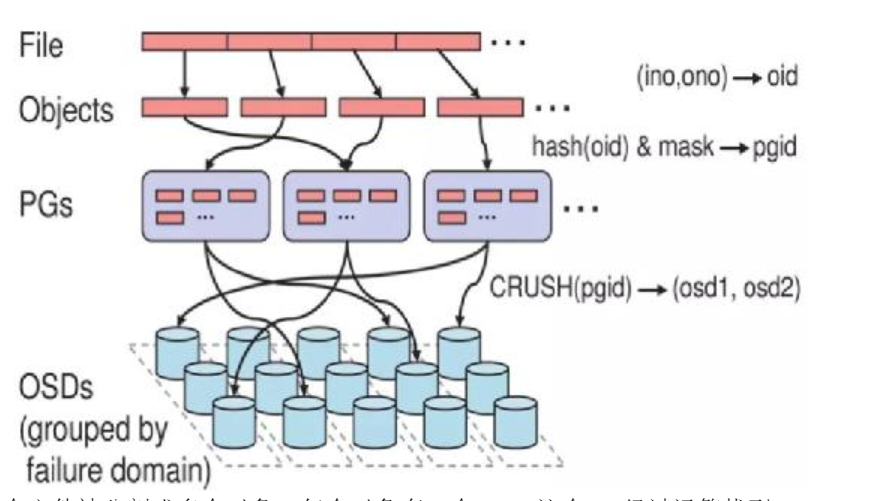
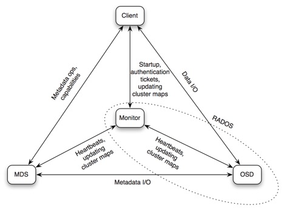

实习工作总结

（一）EFK告警功能

   这部分工作分为两块，本地部署与容器封装

- 本地部署：

    主要通过网上插件源码实现，其中项目地址  :  ` https://github.com/zenland/logging-alert_local`
    上述文件中包括了环境、配置、自定义报警实现说明。
    由于只是在本地测试，README中的自定义报警格式一章以CPU信息收集为例，介绍了自定义消息格式。另外需要注意的是该插件的报警类型配置，该部分主要在配置文件说明一章中介绍。
- docker封装：

    基于上一部分工作将告警功能实现封装为docker容器，其中项目地址: `https://github.com/zenland/longging_alert_docker`
    这部分需要注意的主要是报警规则配置文件：config.yaml，rules/；自定义报警方法实现python文件*_alert.py，需要将其映射到容器内部。

（二）Bugzilla部署

   这部分工作同样分为两部分，普通版的bugzilla和改进版的bugzilla部署

- 普通版部署:

  项目地址: `https://github.com/zenland/bugzilla_docker`
  由于源码本身的bug，导致容器内某个数据库、bug用户以及某个文件夹不存在，需要手动创建，创建方法在注意事项一栏。
- 改进版部署:

  项目地址: `https://github.com/zenland/bugzilla_harmony`
  这部分需要注意的主要是端口映射和容器内的重定向地址，更改规则在启动说明一栏中定义。

（三）Graylog系统研究与改进

   这部分工作大致可以分为三块：系统研究，告警功能改进，使用说明

   项目地址：`https://github.com/zenland/graylog` 这一节以下地址相对于该项目地址

- 系统研究:

    这部分在项目README的系统说明中记录，包括访问控制、数据rotation与retention机制、dashboard、extractor、pipeline与alert部分系统说明。
    其余还有decorator、lookup tables部分说明，这部分在实践中作用不大。
- 告警功能改进:

    这部分在项目README的系统说明/alert一节中记录，其中告警功能包括两块，邮件告警和钉钉告警。
    其中邮件告警部分需要注意的是发送邮件的一些配置，包括代理服务器等，这在alert/email告警一栏由记录
    钉钉告警是参考telegram alert，使用官网sample_plugin改写的插件（代码是自己写的，环境使用了telegram alert的环境配置）。改写后的源码地址在`./code/my_dingding_alert/`
- 使用说明:

    这部分在文档收集数据，转发数据，接收数据，解析数据部分介绍，并附有截屏说明。
    需要注意的地方是，为了兼容fluent-bit的输出与graylog的输入，所以增加了fluentd来协调两者格式，即fluent-bit输出到fluentd，fluentd再发送给graylog。这部分配置在文档的收集数据，转发数据部分。
    另外在解析数据时候，收集到的数据为json格式，需要先使用extractor解析，接着在处理Level，和time字段时候使用了pipeline，具体pipeline匹配规则在文档的解析数据部分介绍。

（四）Ceph学习

   这部分工作主要包括学习和实践部分，很多都是自己理解，所以不一定正确。

   这部分实践部分生成的全部的配置文件在`106.75.229.247`这台主机的`/home/jane/ceph2`文件夹中。

+ 学习部分

  + ceph集群

    ceph集群包括三种结点:monitor,manager,osd。其中monitor的作用是维护集群状态，存储有monitor map，manager map，osd map。Manager结点存储一些系统信息，包括当前集群状态，性能系统负载。osd存储数据。cephfs架构中还包括mds保存文件系统的元数据。

  + object存储

    

     一个文件被分割成多个对象，每个对象有一个oid，这个oid经过运算找到placement group id，接着pgid再经过CRUSH算法计算出该对象存储在osd的位置。

    可以认为placement group为一个抽象的层，包括了很多对象。

    很多文章在介绍object storage存储的时候都有pool的概念，而在上述过程中是没法体现pool的，所以我的理解是：pool只是一个抽象的概念，他里面包括很多placement group，其作用只是说一个pool里面的placementgroup应该被备份几次，便于统一管理。

  + rbd存储

    块存储可以认为是我有一个完整的磁盘，该磁盘有自己的文件系统格式，接着将这个磁盘等分成若干个小块，认为每一个小块是一个对象。根据上述所说的对象存储流程，可以将每一个小块都放到某一个osd中。

    而且一个磁盘所划分的若干个小块都有自己的标识，记录自己是第几个块，存储了多少数据这样的信息。

    基于上述思想那么就可以把每个osd的存储设备都给取下来，接着根据小块的信息把整个大块恢复。

  + cephfs存储

    

    相对于rbd架构多了MDS结点来存储文件系统的元数据。另外mds在启动的时候可以选择冷备份和热备份，这部分问了杨振，好像目前只支持冷备份。

    冷备份：是多个MDS结点只有一个存储有文件系统的元数据，其他结点只是和MDS保持一个心跳，确保这个结点还活着，这个active结点停止工作以后，cold的mds结点开始从原来active结点取元数据。（看的时候有点疑惑，如果active这个节点突然死掉，那么其他mds怎么去取数据呢？既然这样，其它mds节点的作用是不是也就只在于监测了？）

    热备份：多个mds时时刻刻保持同步，active的mds结点停止工作以后原来cold的结点无须同步过程即可开始工作。

    

+ 实践部分

  + ceph单节点环境搭建

    主要参考这篇文章`http://www.cnblogs.com/YaoDD/p/5217578.html`,成功部署后的全部生成文件在`106.75.229.247`这台主机的`/home/jane/ceph2`中，在部署过程中主要遇到两个问题。

    + 问题1： 无法在主机上面安装ceph

      解决方案：手动下载所需要rpm包，下载地址`http://mirrors.ustc.edu.cn/ceph/rpm-jewel/el7/x86_64/`,另外在`./rpm/`地址有下载好的所有包。

    + 问题2：无法找到文件

      解决方案：是网络问题，需要在`ceph.conf`文件中正确配置publice_network这一项。参考配置在`./conf/ceph.conf`文件中。

  + object存储实践

    这部分主要参考这篇文章`http://docs.ceph.com/docs/jewel/rados/api/python/`

    实践包括：

    + 查询集群状态: 代码在`./code/client.py`

    + 创建查询pool: 代码在`./code/pool.py`

    + 对对象进行增删改查操作：代码在`./code/io.py`

      

  + rbd存储实践

    推荐一篇很不错的博客，对rbd的实践主要参考这篇文章：`https://cloud.tencent.com/developer/article/1006283。`

    实践包括：

    + 创建以及读写块：代码在`./code/myrbd.py`

    在实践中发现如果将rbd映射地点的文件进行更改，再去使用rbd命令获取各个pool中的文件可以看到更改之前文件的信息，原因在于对文件进行更改时，文件系统只是将该部分区域标记为了可用，而其中的信息并没有真正消失，所以从集群中去获取一个块的每个小单元时候仍可以获取到该更改前的信息。

    另外使用rbd命令时候有一步是创建了一个块后先给某个块创建文件系统格式，接着才可以去读写。而使用python操纵时，创建了一个块以后直接就可以读写，而这个块此时是没有文件系统格式的。查看这个块的信息发现该块的确没有文件系统格式，写入的信息是以ASCII方式编码直接存储进这块区域的。

  + cephfs存储实践（未完成）

    这部分尝试了kernal挂载和fuse形式的挂载，都很简单，只需要一个命令就好了，只是敲了命令以后就一直没反应，所以这个环境还未搭建好。

    主要参考文章`https://my.oschina.net/u/2460844/blog/705369`
